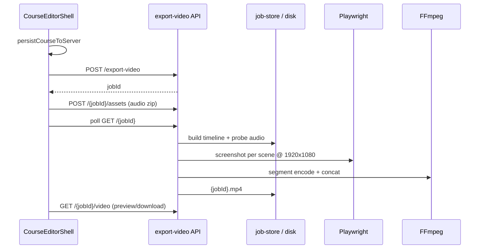

# Studio 讲解视频导出（1080p MP4）设计规格

**日期：** 2026-05-17  
**状态：** 已批准  
**范围决策：** B — 导出全部场景类型（slide 真实画面；quiz / interactive / pbl 静态摘要卡 + 讲解音）

---

## 背景

OpenMAIC 章节 Studio（`ChapterStudioShell` → `CourseEditorShell`）已有「创建视频草稿」入口，但当前 `POST /api/export-video` 仅生成 **JSON 时间线**（`render-plan.json`），不产出 MP4，也无法预览或下载讲解视频。

教师需要：将当前章节的 **PPT 幻灯片 + 讲解 TTS** 合成为 **1080p MP4**，支持 **预览播放** 与 **下载**。

---

## 目标

| 能力 | 说明 |
|------|------|
| 输入 | 当前 classroom 的 `scenes`（含 slide / quiz / interactive / pbl）及 `speech` 讲解音频 |
| 输出 | 单文件 MP4，1920×1080，H.264 + AAC |
| 预览 | Studio 内 `<video controls>` 播放 |
| 下载 | `GET /api/export-video/{jobId}/video` 带 attachment |
| 异步 | 复用现有 job 队列与轮询；展示分步进度 |

## 非目标（MVP）

- 转场动画、聚光灯/激光、白板动作录像
- 4K / 竖屏 / 烧录字幕
- 多章节合并为一个 MP4
- 无讲解时自动批量 TTS（仅提示用户先生成音频）

---

## 场景渲染规则（范围 B）

按 `scene.order` 顺序处理：

| `scene.type` | 画面 | 时长 |
|--------------|------|------|
| `slide` | 与编辑器一致的 canvas，缩放至 1920×1080 | 各 `speech` 段音频实测时长之和；无 speech 时 **3s** |
| `quiz` | 静态测验摘要卡（标题、类型、题干摘要） | 各 `speech` 音频时长之和；无 speech 时 **5s** |
| `interactive` / `pbl` | 静态场景摘要卡 | 同上 |

**讲解音：** 按 `actions` 顺序，每个 `type === 'speech'` 为一段；该段期间画面保持当前场景帧不变。同场景多段 speech 顺序拼接。

**音频来源优先级：**

1. `SpeechAction.audioUrl`（服务端 `classroom-media`）
2. 导出任务上传包内 `audio/{audioId}.{ext}`（来自客户端 IndexedDB）

**前置校验：** 存在 `speech.text` 但无法解析音频 → **阻断导出**，返回缺失场景列表（不生成无声段）。

---

## 架构（混合方案）



1. **客户端**：保存课堂 → 收集 IndexedDB 音频 → 创建 job → 上传 assets zip → 轮询。
2. **服务端**：构建时间线 → Headless 渲染帧 → FFmpeg 合成 MP4 → 提供 `video/mp4` URL。

---

## API

| 方法 | 路径 | 说明 |
|------|------|------|
| `POST` | `/api/export-video` | Body: `{ classroomId, resolution: "1080p" }` → `{ jobId, pollUrl }` |
| `POST` | `/api/export-video/[jobId]/assets` | `multipart/form-data`：`assets.zip`（`audio/*`） |
| `GET` | `/api/export-video/[jobId]` | Job 状态、`progress`、`videoUrl`（成功时） |
| `GET` | `/api/export-video/[jobId]/video` | MP4 流；`?download=1` 强制 attachment |
| `GET` | `/export-video/render/[jobId]` | 内部渲染页（`?token=` 短时 HMAC） |

**Artifact（替换 JSON render-plan）：**

```typescript
interface VideoExportArtifact {
  videoPath: string;
  videoUrl: string;
  durationSeconds: number;
  width: 1920;
  height: 1080;
  format: 'mp4';
}
```

**Job 步骤：** `queued` → `collecting-assets` → `render-plan` → `rendering` → `encoding` → `completed` | `failed`

---

## 模块划分

| 路径 | 职责 |
|------|------|
| `lib/server/video-export/timeline.ts` | `buildVideoTimeline(scenes, assetsDir)` → 段列表（sceneId、pngPath、audioPath、durationMs） |
| `lib/server/video-export/ffmpeg.ts` | 探测 FFmpeg、单段编码、concat |
| `lib/server/video-export/render.ts` | Playwright 截图编排 |
| `lib/server/video-export/render-token.ts` | HMAC token 生成/校验 |
| `lib/server/video-export-runner.ts` | 编排 job 生命周期 |
| `app/export-video/render/[jobId]/page.tsx` | Headless 加载场景并暴露 `window.__exportVideoCapture(sceneId)` |
| `components/video-export/summary-card.tsx` | quiz / interactive / pbl 摘要 UI |
| `lib/teacher/collect-export-audio.ts` | 从 scenes + IndexedDB 收集 zip |
| `components/course-editor/video-export-dialog.tsx` | 进度、预览、下载 |
| `lib/teacher/video-export-client.ts` | 扩展 upload + poll 字段 |

---

## UI（CourseEditorShell）

- 工具栏按钮文案：**生成讲解视频**（替换「创建视频草稿」）。
- 点击后打开 `VideoExportDialog`：
  - 进行中：步骤 + 进度条
  - 成功：`<video controls src={videoUrl}>` + 下载按钮
  - 失败：错误信息 + 重试
- i18n：更新 `lib/i18n/locales/*.json`，运行 `pnpm check:i18n-keys`。

---

## 依赖与部署

- **FFmpeg / ffprobe**：运行环境 PATH 可执行；启动 job 前探测，不可用则 `failed` 并提示。
- **Playwright Chromium**：与 e2e 相同安装方式；生产 Docker 需包含浏览器依赖。
- **安全**：渲染页 token 单次有效、短 TTL；`export-video` 校验 classroom 归属（对齐 teacher/classroom 现有鉴权）。

---

## 测试策略

- **单元**：`buildVideoTimeline`（多类型场景、多 speech、缺音频失败）。
- **集成**：mock `ffmpeg` / Playwright，断言 job 成功且 artifact 指向 `.mp4`。
- **E2E（可选）**：短课 2 slide + 1 quiz，mock 编码后断言预览可见。

---

## 与现有代码关系

- 扩展 `lib/server/video-export-runner.ts`、`video-export-job-store.ts`，不新建并行 API 命名空间。
- `ChapterStudioShell` 已通过 `CourseEditorShell` 复用工具栏，无需重复按钮。
- 废弃对 `render-plan.json` 的成功态 UI（「查看草稿」链接）；开发阶段可保留 artifact 路由只服务旧 job。

---

## 参考文件

- `components/course-editor/course-editor-shell.tsx` — 现有导出触发与轮询
- `lib/server/video-export-runner.ts` — 当前 stub 实现
- `lib/teacher/video-export-client.ts` — 客户端 API
- `lib/export/classroom-zip-utils.ts` — `collectAudioFiles` 模式
- `lib/server/classroom-media-generation.ts` — 服务端 TTS `audioUrl`
