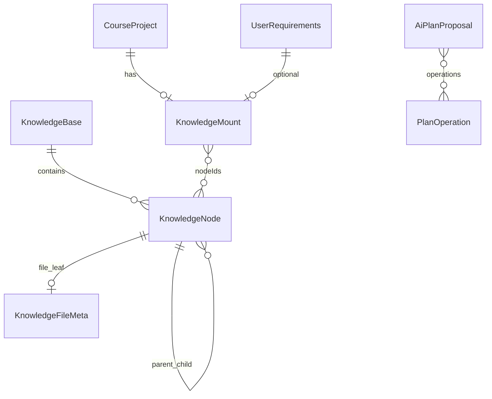
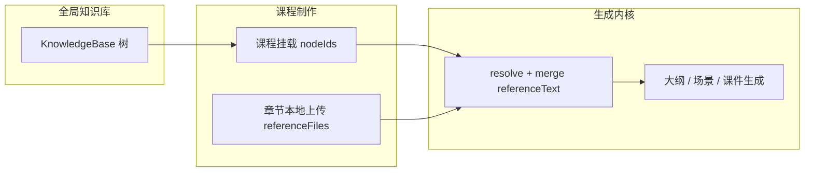

# 知识库管理模块设计方案

## 背景

OpenMAIC 在教师课程制作中已支持**章节级本地上传参考资料**（`ChapterReferenceFile`），首页学生快速生成支持单份 PDF。这些资料与课程/章节强绑定，无法跨项目复用，也没有统一的目录树管理。

本方案新增**全局知识库**：支持树形目录、多格式文件、AI 辅助规划目录（用户确认后生效），课程与首页生成可通过**挂载引用**选用库内资料（不复制文件），并与现有章节本地上传参考资料**并存**。

## 已确认的产品决策

| 维度 | 决策 |
|------|------|
| 组织模型 | **D**：全局知识库 + 课程/会话挂载引用（不复制物理文件） |
| 隔离 | **D**：单用户 MVP，元数据预留 `ownerId` / `workspaceId` |
| 选材范围 | **D**：课程项目级挂载 + 首页快速生成可选；章节保留本地上传补充 |
| AI 目录 | **C**：批量导入初稿 + 管理页对话微调；**用户确认后才 apply**；确认后允许移动已有文件 |
| 文件格式 | **D**：尽量支持全格式；MVP 核心格式参与生成，其余先入库并标记状态 |
| 技术路线 | **方案 1**：服务端 `data/knowledge-base/` + JSON 元数据（与 `teacher-projects` 一致） |

## 目标与非目标

### 目标

- 首页提供知识库管理入口（教师/学生均可见，至少教师完整使用）。
- 知识库管理页：树形目录 CRUD、文件上传/预览/删除、AI 规划提案预览与确认。
- 教师设计工作台：课程级挂载知识库节点；章节仍可使用 `ChapterReferenceField` 本地上传。
- 首页快速生成：在 `LlmComposerActionRow` 区域增加「知识库」选材，将 `knowledgeNodeIds` 传入生成 API。
- 生成链路统一解析挂载 + 章节 reference，注入现有 `referenceText` / `pdfContent` 路径。

### 非目标（MVP）

- 多用户/工作区隔离（仅预留字段）。
- 向量 RAG（二期）；MVP 使用全文抽取 + 长度截断。
- 音视频转写入库（可上传存储，标记 `parseStatus: unsupported`）。
- 将设置面板中未实现的 `settings.knowledgeBase` 节作为唯一入口（独立路由为主）。

---

## 第 1 部分：架构与数据模型

### 1.1 实体关系



### 1.2 类型定义（建议 `lib/knowledge-base/types.ts`）

```ts
/** MVP: 仅 default 库；预留多库 */
export interface KnowledgeBaseMeta {
  id: string; // 'default'
  name: string;
  rootId: string;
  revision: number;
  ownerId?: string;
  workspaceId?: string;
  createdAt: string;
  updatedAt: string;
}

export type KnowledgeNodeType = 'folder' | 'file';

export interface KnowledgeNode {
  id: string;
  parentId: string | null;
  type: KnowledgeNodeType;
  name: string;
  /** 展示路径，apply 时重算 */
  displayPath: string;
  sortOrder: number;
  createdAt: string;
  updatedAt: string;
  /** type === 'file' 时必填 */
  file?: KnowledgeFileMeta;
}

export type KnowledgeParseStatus =
  | 'pending'
  | 'ready'      // 文本已抽取，可参与生成
  | 'partial'    // 如图：仅有描述/文件名
  | 'unsupported'
  | 'failed';

export interface KnowledgeFileMeta {
  storageKey: string;
  originalName: string;
  mimeType: string;
  size: number;
  category: KnowledgeFileCategory;
  parseStatus: KnowledgeParseStatus;
  extractPath?: string; // data/knowledge-base/extracts/{id}.txt
  parseError?: string;
}

export interface KnowledgeMount {
  nodeIds: string[];
}

/** 挂到 CourseProject */
export interface CourseProjectKnowledge {
  mount: KnowledgeMount;
  /** 可选：章节从课程挂载中排除的节点（轻量实现「课程默认 + 章节增删」） */
  chapterExclusions?: Record<string, string[]>;
}

/** 扩展 UserRequirements */
// knowledgeNodeIds?: string[];

export type PlanOperation =
  | { op: 'mkdir'; parentId: string | null; name: string; tempId: string }
  | { op: 'move'; nodeId: string; newParentId: string | null; newName?: string }
  | { op: 'rename'; nodeId: string; newName: string }
  | { op: 'delete'; nodeId: string }
  | { op: 'assign'; tempFileId: string; parentId: string | null; name: string }
  | { op: 'remove'; nodeId: string };

export interface AiPlanProposal {
  id: string;
  status: 'pending' | 'applied' | 'discarded';
  summary: string;
  operations: PlanOperation[];
  createdAt: string;
  expiresAt: string;
}
```

### 1.3 存储布局

```
data/knowledge-base/
  meta.json
  tree.json                 # { nodes: KnowledgeNode[], revision }
  files/{nodeId}/{filename}
  extracts/{nodeId}.txt
  uploads-staging/{uploadId}/   # 批量导入暂存，apply 或超时清理
  proposals/{proposalId}.json
```

课程项目扩展（`CourseProject`）：

```ts
knowledge?: CourseProjectKnowledge;
```

### 1.4 挂载语义

- 挂载 **folder** 节点 → 生成时递归展开为所有后代 `type: file`。
- 挂载 **file** 节点 → 仅该文件。
- 删除库内节点后，挂载 ID 失效；`resolveKnowledgeMountContext` 跳过并收集 `missingNodeIds` 供 UI 提示。
- 章节 `referenceFiles` 仍复制存储在 `teacher-projects/.../references/`，与全局库物理隔离。

### 1.5 文件类型策略

| 类别 | 扩展名 | MVP 解析 | 生成参与 |
|------|--------|----------|----------|
| 文档 | pdf, docx, pptx, xlsx, txt, md, html | 复用 `extractChapterReferenceText` + HTML 转文本 | yes |
| 图片 | jpg, jpeg, png, webp, gif | 可选：文件名 + 未来 vision 摘要 | partial |
| 旧 Office | doc, xls, ppt | 拒绝或仅存储 | no |
| 压缩包 | zip | 二期解压入库；MVP 可拒绝或仅存储 | no |
| 音视频 | mp3, mp4, … | 仅存储 | no |

统一 allowlist：`lib/knowledge-base/file-types.ts`（扩展 `chapter-reference-file-types`，避免双份逻辑）。

### 1.6 生成上下文合并

新增 `lib/knowledge-base/resolve-mount-context.ts`：

```
resolveKnowledgeMountContext(nodeIds: string[]): Promise<{
  referenceText: string;
  files: ResolvedFile[];
  missingNodeIds: string[];
  unsupported: string[];
}>

mergeReferenceSources(kbText, chapterExtractText): string
// 去重、截断（默认 6000 字符，与 DESIGN_BRIEF_REFERENCE_MAX_CHARS 对齐或可配置）
```

接入点：

- `lib/teacher/chapter-generation-enrichment.ts`
- `lib/teacher/chapter-generation-input.ts`（`buildChapterDesignBrief`）
- `app/api/teacher/projects/.../generate-outline|generate-chapter`
- `lib/server/classroom-generation.ts`（首页快速生成）
- `app/generation-preview` 相关请求体

---

## 第 2 部分：页面与交互

### 2.1 路由与入口

| 入口 | 位置 | 行为 |
|------|------|------|
| 首页右上角工具条 | `app/page.tsx` 固定 pill 内，Settings 左侧 | 图标 `Library` / `BookOpen`，跳转 `/knowledge-base` |
| 知识库管理页 | `app/knowledge-base/page.tsx` | 主管理界面 |
| 教师设计工作台 | `course-project-design-shell` 课程概览区 | 「课程知识库」折叠面板 |
| 首页输入区 | `LlmComposerActionRow` 旁 | 「知识库」按钮，打开选材 Popover/Sheet |
| 教师新建课程 | `app/teacher/new` | 可选继承首页已选 `knowledgeNodeIds`（sessionStorage handoff） |

**不**在 Settings 对话框内实现完整树编辑（`settings.knowledgeBase` i18n key 可保留或改为跳转链接）。

### 2.2 知识库管理页（`/knowledge-base`）

布局：**左侧目录树 + 右侧详情/操作区**。

**左侧树**

- 展示 folder/file 图标、名称、`parseStatus` 徽章。
- 支持：新建文件夹、重命名、删除（确认对话框）、拖拽排序/移动（MVP 可用「移动到…」对话框代替完整拖拽）。
- 多选文件上传至当前选中文件夹（或根）。
- 批量导入：选择多文件或 ZIP（ZIP 二期；MVP 多文件即可触发 AI 初稿）。

**右侧详情**

- 文件：大小、类型、上传时间、解析状态、预览（PDF/HTML 内嵌 iframe，图片缩略图，Office 提示下载）。
- 下载原文件、重新解析、删除。
- **AI 助手面板**（可折叠）：输入自然语言 → 生成 proposal → 展示 diff → 确认/丢弃。

**AI 规划 UX**

1. 导入/对话后显示「待确认方案」横幅。
2. Diff 视图：绿色新增文件夹、蓝色移动路径、红色删除（删除需二次确认）。
3. 按钮：**应用** / **丢弃** / **仅采纳部分**（MVP 可只做全量应用）。
4. Apply 成功后 toast + 刷新树；失败回滚并展示错误。

### 2.3 选材组件（复用）

`components/knowledge-base/knowledge-picker.tsx`

- Props: `selectedNodeIds`, `onChange`, `mode: 'multi' | 'single'`.
- 内嵌简化树 + 搜索过滤（按 `displayPath`）。
- 显示已选 chips，可移除。
- 用于：首页 composer、教师课程概览、（可选）章节级追加挂载。

### 2.4 教师设计工作台

在 `course-overview-block` 或独立卡片：

- **课程知识库挂载**：`KnowledgePicker` 绑定 `project.knowledge.mount.nodeIds`。
- 持久化：PATCH project API（与现有 `writeTeacherProject` 一致）。
- 章节列表：保留 `ChapterReferenceField`；tooltip 说明「优先使用课程知识库；此处为章节补充资料」。
- （可选 MVP+）章节行「排除课程库中的…」→ 写入 `chapterExclusions[chapterId]`。

### 2.5 首页快速生成

- `FormState` 增加 `knowledgeNodeIds: string[]`。
- 与 PDF 附件并列：用户可同时选知识库 + 单 PDF（合并时去重）。
- 进入 `generation-preview` 时随 body 传递；handoff 到教师新建时写入 sessionStorage（扩展 `TeacherHomepageRequirement` 或新 key `teacher.homepageKnowledge`）。

### 2.6 i18n

在 `lib/i18n/locales/*.json` 新增命名空间 `knowledgeBase.*`（管理页、picker、状态枚举、AI 提案文案）。运行 `pnpm check:i18n-keys`。

---

## 第 3 部分：API 与 AI Proposal 协议

### 3.1 REST 路由（`app/api/knowledge-base/`）

| 方法 | 路径 | 说明 |
|------|------|------|
| GET | `/api/knowledge-base` | 返回 meta + 完整树（或分页，MVP 全量） |
| POST | `/api/knowledge-base/nodes` | 手动 `mkdir` |
| PATCH | `/api/knowledge-base/nodes/[nodeId]` | 重命名、移动（人工直接改树） |
| DELETE | `/api/knowledge-base/nodes/[nodeId]` | 删除节点及文件 |
| POST | `/api/knowledge-base/files` | multipart 上传到 `parentId` |
| GET | `/api/knowledge-base/files/[nodeId]/download` | 下载原文件 |
| GET | `/api/knowledge-base/files/[nodeId]/extract` | 获取抽取文本（调试用） |
| POST | `/api/knowledge-base/files/[nodeId]/reparse` | 重新抽取 |
| POST | `/api/knowledge-base/import` | 批量上传到 staging + 触发 AI 初稿 proposal |
| POST | `/api/knowledge-base/ai/plan` | body: `{ message, contextNodeId? }` → proposal |
| GET | `/api/knowledge-base/ai/proposals/[id]` | 获取 proposal |
| POST | `/api/knowledge-base/ai/proposals/[id]/apply` | 确认应用 |
| POST | `/api/knowledge-base/ai/proposals/[id]/discard` | 丢弃 |

教师项目挂载（可合并进现有 project route）：

| 方法 | 路径 | 说明 |
|------|------|------|
| PATCH | `/api/teacher/projects/[projectId]/knowledge` | 更新 `project.knowledge.mount` |

校验：

- 文件大小上限 50MB（与章节 reference 一致）。
- `isValidTeacherProjectId` 同类规则用于 `nodeId`（nanoid）。
- SSRF：知识库无外链 URL 导入（MVP）。

### 3.2 AI 规划实现要点

**Prompt 模板**：`lib/prompts/templates/knowledge-base-plan/`

输入：

- 当前树 JSON（可裁剪深度/仅列文件夹结构 + 文件名列表）。
- 用户消息或导入文件列表（文件名、可选的首页摘要 extract）。
- 规则：输出 **严格 JSON** 的 `operations[]`，不直接改盘。

**解析**：zod schema 校验 `PlanOperation[]` → 写入 `proposals/{id}.json`。

**Apply 算法**（事务性）：

1. 校验所有 `nodeId` / `parentId` 存在且无环。
2. `mkdir` 先执行（`tempId` → 真实 id 映射表）。
3. `assign` 将 staging 文件落入 `files/{nodeId}/`。
4. `move` / `rename` 更新 `tree.json`。
5. `delete` / `remove` 最后执行，删除磁盘文件。
6. `revision++`，写 `meta.json` / `tree.json`（`writeJsonFileAtomic`）。
7. 标记 proposal `applied`。

失败：不部分写入（或写前备份 `tree.json.bak`）。

**LLM 调用**：复用 `callLLM` + 用户 settings 中的默认模型；无 key 时 AI 规划按钮 disabled。

### 3.3 生成 API 变更

扩展请求体（示例）：

```ts
// POST /api/generate-classroom, teacher generate routes
{
  requirement: string;
  knowledgeNodeIds?: string[];
  // 现有 pdfContent, ...
}
```

服务端在 enrichment 前调用 `resolveKnowledgeMountContext`。

---

## 第 4 部分：分期、测试与风险

### 4.1 实施分期

**Phase 1 — MVP（可演示闭环）**

- [ ] `data/knowledge-base` 存储 + CRUD API
- [ ] `/knowledge-base` 管理页（树 + 上传 + 人工移动）
- [ ] 首页入口 + `KnowledgePicker` + 快速生成注入
- [ ] `CourseProject.knowledge` + 设计工作台挂载
- [ ] `resolve-mount-context` + 合并章节 reference
- [ ] 核心格式解析（pdf/office/text/html）
- [ ] AI：仅「批量导入 → proposal → apply」（对话规划可 Phase 1.5）

**Phase 1.5**

- [ ] AI 对话微调 proposal
- [ ] 章节 `chapterExclusions`
- [ ] 树内搜索、移动到对话框优化

**Phase 2**

- [ ] 多知识库 / `workspaceId` 隔离
- [ ] ZIP 解压入库
- [ ] 向量 RAG（embedding + 按需求检索片段）
- [ ] 图片 vision 摘要、音视频转写

### 4.2 测试策略

| 层级 | 内容 |
|------|------|
| 单元 | `resolve-mount-context` 展开文件夹、截断、去重；`applyProposal` 操作序列；file-types allowlist |
| 集成 | API 上传 → 抽取 → 生成 brief 含文本；proposal apply 后树一致 |
| E2E（可选） | 首页选库 → 生成预览；教师挂载 → 章节生成 |

### 4.3 风险与缓解

| 风险 | 缓解 |
|------|------|
| 大库全量注入超 token | 截断 + 二期 RAG；UI 提示已选文件总大小 |
| 并发编辑 tree.json | MVP 单用户；`revision` 乐观锁冲突返回 409 |
| AI 错误移动文件 | 必须 preview + confirm；apply 前备份 |
| 与章节 reference 重复 | 合并去重；UI 分别展示来源 |

### 4.4 关键文件（实现时新建/修改）

**新建**

- `lib/knowledge-base/*`
- `app/knowledge-base/page.tsx`
- `app/api/knowledge-base/**`
- `components/knowledge-base/*`
- `lib/prompts/templates/knowledge-base-plan/*`

**修改**

- `app/page.tsx`（入口 + form state）
- `lib/teacher/course-types.ts`、`course-project-storage.ts`（migrate）
- `lib/types/generation.ts`（`knowledgeNodeIds`）
- `lib/teacher/chapter-generation-enrichment.ts`
- `lib/server/classroom-generation.ts`
- `components/generation/llm-composer-action-row.tsx`
- `components/teacher/course-project-design-shell.tsx` 或 `course-overview-block.tsx`

---

## 附录：与现有能力的关系



---

## 规格自检（2026-05-20）

- [x] 无占位「待定」章节；决策表覆盖用户确认项
- [x] 挂载不复制与 `CourseProject` / `UserRequirements` 扩展一致
- [x] AI 确认后 apply 与「允许移动文件」一致
- [x] MVP 范围明确（RAG、多用户、ZIP 为二期）
- [x] API 与现有 `teacher-projects`、`chapter-reference` 模式对齐

---

**下一步**：用户审查本规格 → 批准后调用 **writing-plans** 技能生成 `docs/superpowers/plans/2026-05-20-knowledge-base.md` 实现计划。
